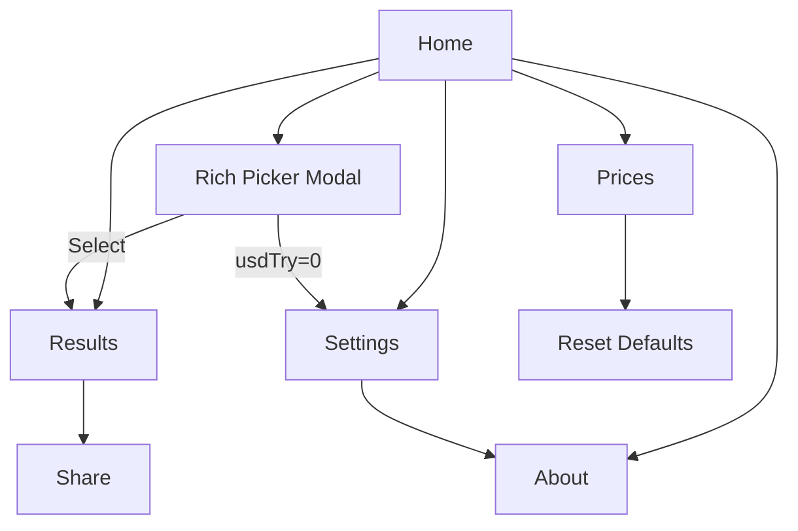
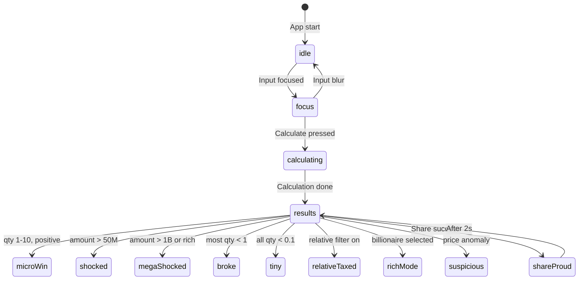

# Züğürdün Çenesi - Design Document

## Screen Flow



---

## Data Models

### Settings
```typescript
interface Settings {
  usdTry: number;           // Default: 30
  humorLevel: 'soft' | 'mid' | 'hard';  // Default: 'mid'
  rounding: 0 | 1 | 2;      // Default: 0
  abbreviate: boolean;       // Default: true
  relativeFilterOn: boolean; // Default: false
  relativeSharePct: number;  // Default: 15, range 0-100
  theme: 'light' | 'dark' | 'system';  // Default: 'system'
}
```

### Price Item
```typescript
interface PriceItem {
  id: string;
  name: string;
  priceTL: number;
  category: CategoryId;
  icon?: string;
}
```

### Category
```typescript
type CategoryId = 'buyuk' | 'gida' | 'ulasim' | 'teknoloji' | 'eglence' | 'zugurt';

interface Category {
  id: CategoryId;
  name: string;
  icon: string;
  enabled: boolean;
}
```

### Rich Entry
```typescript
interface RichEntry {
  id: number;
  name: string;
  netWorthUsdB: number;
}
```

### Calculation Result
```typescript
interface CalcResult {
  amountTL: number;
  amountAfter: number;  // After relative filter
  items: ItemResult[];
  punchlines: Punchline[];
  mood: MoodType;
}

interface ItemResult {
  item: PriceItem;
  qty: number;
  qtyDisplay: string;
}

interface Punchline {
  item: PriceItem;
  qty: number;
  text: string;
}
```

---

## UI Specifications

### Color Palette

**Light Theme**
- Background: #FAFAFA
- Surface: #FFFFFF
- Primary: #FF6B35 (vibrant orange)
- Secondary: #004E89 (deep blue)
- Text: #1A1A2E
- Muted: #6B7280

**Dark Theme**
- Background: #0F0F1A
- Surface: #1A1A2E
- Primary: #FF8C5A
- Secondary: #4A9FD4
- Text: #F5F5F5
- Muted: #9CA3AF

### Typography
- Headings: Inter Bold
- Body: Inter Regular
- Numbers: Inter Medium (tabular)
- Mascot Bubble: Inter SemiBold

### Spacing Scale
- xs: 4px, sm: 8px, md: 16px, lg: 24px, xl: 32px, 2xl: 48px

---

## Screen Designs

### Home Screen
```
┌──────────────────────────┐
│     [Mascot + Bubble]    │
│   "Parayı yaz da..."     │
├──────────────────────────┤
│  ┌────────────────────┐  │
│  │    ₺ 0             │  │
│  └────────────────────┘  │
│  [1M] [10M] [100M] [1B]  │
├──────────────────────────┤
│  Categories:             │
│  [✓Büyük][✓Gıda][✓Ulaşım]│
│  [✓Tekno][✓Eğlen][✓Züğrt]│
├──────────────────────────┤
│  [👑 Zenginlerden Seç]   │
│                          │
│     [  HESAPLA  ]        │
├──────────────────────────┤
│  🏠    📊    ⚙️    ℹ️   │
│ Home  Fiyat  Ayar  Hak.  │
└──────────────────────────┘
```

### Rich Picker (Modal)
```
┌──────────────────────────┐
│  Zenginler          [X]  │
├──────────────────────────┤
│  🔍 Ara...               │
├──────────────────────────┤
│  1. Elon Musk    $676B   │
│  2. Larry Page   $287B   │
│  3. Sergey Brin  $267B   │
│  ...                     │
├──────────────────────────┤
│  📊 Bloomberg Index      │
│  29 Ocak 2026            │
└──────────────────────────┘
```

### Results Screen
```
┌──────────────────────────┐
│     [Mascot shocked]     │
│   "Bu rakam... ciddi!"   │
├──────────────────────────┤
│  ₺ 600.000.000           │
│  (Loto kazancı)          │
├──────────────────────────┤
│  🏠 120 Ev               │
│  🚗 300 Araba            │
│  🌯 2.4M Döner           │
├──────────────────────────┤
│  [Card: Büyük]           │
│  Ev: 120 | Araba: 300    │
│  Arsa: 400 | Kira: 1666  │
├──────────────────────────┤
│  [Card: Gıda]            │
│  Döner: 2.4M | Kahve: 5M │
├──────────────────────────┤
│     [ 📤 PAYLAŞ ]        │
├──────────────────────────┤
│  🏠    📊    ⚙️    ℹ️   │
└──────────────────────────┘
```

### Prices Screen
```
┌──────────────────────────┐
│  Fiyatlar        [Reset] │
├──────────────────────────┤
│  ▼ Büyük                 │
│  ├─ Ev         ₺5.000.000│
│  ├─ Araba      ₺2.000.000│
│  └─ Arsa       ₺1.500.000│
│                          │
│  ▼ Gıda                  │
│  ├─ Döner          ₺250 │
│  ├─ Kahve          ₺120 │
│  └─ Ekmek           ₺15 │
├──────────────────────────┤
│     [ 💾 KAYDET ]        │
├──────────────────────────┤
│  🏠    📊    ⚙️    ℹ️   │
└──────────────────────────┘
```

### Settings Screen
```
┌──────────────────────────┐
│  Ayarlar                 │
├──────────────────────────┤
│  Tema                    │
│  [Açık] [Koyu] [Sistem]  │
├──────────────────────────┤
│  Mizah Seviyesi          │
│  [Soft] [Mid] [HARD]     │
├──────────────────────────┤
│  USD/TRY Kuru            │
│  ┌───────────┐           │
│  │    30     │           │
│  └───────────┘           │
├──────────────────────────┤
│  Ondalık Basamak: [0]    │
│  Kısaltma (K/M/B): [ON]  │
├──────────────────────────┤
│  Akraba Vergisi: [OFF]   │
│  Pay Oranı: ━━━○━━ 15%   │
├──────────────────────────┤
│  🏠    📊    ⚙️    ℹ️   │
└──────────────────────────┘
```

---

## Mascot State Machine



---

## Animation Specifications

| State | Animation | Duration | Easing |
|-------|-----------|----------|--------|
| idle | Blink every 3-5s | 150ms | ease-in-out |
| idle | Breathing scale | 2s loop | ease-in-out |
| focus | Head tilt | 300ms | ease-out |
| calculating | Jaw tremble | 600ms | linear |
| shocked | Recoil | 200ms | ease-out |
| megaShocked | Jaw drop + confetti | 400ms | spring |
| broke | Sigh | 300ms | ease-in |
| shareProud | Wink + badge pop | 300ms | ease-out |

---

## Storage Schema

### Keys
- `zugurd:settings` - Settings object
- `zugurd:prices` - Custom prices (only edited ones)
- `zugurd:categories` - Category enabled states

### Migration Strategy
- v1: Initial schema
- Future versions: Check version key, migrate if needed
