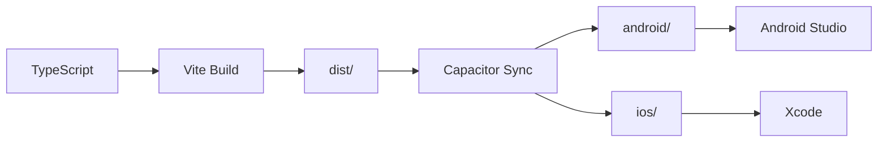

# Züğürdün Çenesi - Technical Implementation Plan

## Module Breakdown

### 1. Core Module (`src/core/`)

#### types.ts
- All TypeScript interfaces and types
- Zod schemas for runtime validation
- Export: Settings, PriceItem, Category, CalcResult, etc.

#### defaults.ts
- DEFAULT_SETTINGS constant
- DEFAULT_PRICES array with all 20+ items
- CATEGORIES constant
- Export: getDefaultSettings(), getDefaultPrices()

#### calc.ts
- `calculate(amount, prices, settings, categories)` → CalcResult
- Handles relative filter reduction
- Sorts items by impact for punchlines
- Pure functions, no side effects

#### format.ts
- `formatNumber(n, settings)` → string
- `formatQty(qty, settings)` → string (handles < 1 case)
- `abbreviate(n)` → "1.2M" style
- `formatCurrency(n)` → "₺1.234.567"

#### humor.ts
- `generatePunchline(item, qty, humorLevel)` → string
- `selectMood(result)` → MoodType
- `getMascotText(mood, humorLevel)` → string
- Punchline templates by category

#### storage.ts
- Abstract class/interface for storage
- `WebStorage` using idb-keyval
- `NativeStorage` using @capacitor/preferences
- Auto-detect platform, export singleton

### 2. Data Module (`src/data/`)

#### rich20.ts
- Static RICH_20 array
- Source metadata (Bloomberg, date)
- Export: getRichList(), getRichById()

### 3. Mascot Module (`src/app/mascot/`)

#### mood.ts
- MoodType enum (12 values)
- Mood → animation config mapping
- Mood → face layer config mapping

#### CheneMascot.tsx
- Props: mood, intensity, humorLevel
- SVG layers: head, eyes, brows, mouth, jaw
- Speech bubble with dynamic text
- CSS animations via className switching

#### stickers/
- 12 SVG files, one per mood
- 64-96px viewBox
- Single color + accent

### 4. UI Module (`src/app/`)

#### components/
- Button, Input, Card, Modal, Toggle, Slider
- CategoryChip, PresetChip, TabBar
- ShareCard (for dom-to-image capture)

#### screens/
- HomeScreen.tsx
- ResultsScreen.tsx
- RichPickerModal.tsx
- PricesScreen.tsx
- SettingsScreen.tsx
- AboutScreen.tsx

#### routes/
- AppRouter.tsx (react-router-dom)
- Bottom TabBar navigation

### 5. Platform Module (`src/platform/`)

#### share.ts
- `share(data)` → native or web fallback
- `generateShareImage(element)` → Blob

#### storage-bridge.ts
- Platform detection
- Unified API for settings/prices/categories

---

## Build Pipeline



---

## Development Workflow

### Setup
```bash
npm create vite@latest zugurdun-cenesi -- --template react-ts
cd zugurdun-cenesi
npm install
npm install -D tailwindcss postcss autoprefixer
npx tailwindcss init -p
```

### Dependencies
```bash
# Core
npm i react-router-dom zod idb-keyval dom-to-image-more

# Capacitor
npm i @capacitor/core @capacitor/cli
npm i @capacitor/android @capacitor/ios
npm i @capacitor/share @capacitor/preferences

# Dev
npm i -D eslint prettier vitest @vitest/ui jsdom @testing-library/react
```

### Scripts (package.json)
```json
{
  "scripts": {
    "dev": "vite",
    "build": "tsc && vite build",
    "test": "vitest",
    "lint": "eslint src --ext ts,tsx",
    "format": "prettier --write src",
    "cap:sync": "npx cap sync",
    "cap:android": "npx cap open android",
    "cap:ios": "npx cap open ios"
  }
}
```

---

## Implementation Order

### Phase 1: Foundation (Day 1)
1. Project scaffold with Vite
2. Tailwind configuration
3. Router + TabBar setup
4. Core types and defaults

### Phase 2: Logic (Day 1-2)
5. calc.ts with tests
6. format.ts with tests
7. humor.ts
8. storage.ts abstraction

### Phase 3: UI (Day 2-3)
9. Mascot component + moods
10. Sticker SVGs
11. Home screen
12. Rich Picker modal
13. Results screen
14. Prices screen
15. Settings screen
16. About screen

### Phase 4: Integration (Day 3)
17. Capacitor config
18. Share implementation
19. Storage bridge (web/native)
20. Offline verification

### Phase 5: Polish (Day 4)
21. Animations fine-tuning
22. Theme polish
23. Store docs
24. README + verify script

---

## Quality Checklist

- [ ] All 8 unit tests pass
- [ ] TypeScript strict mode clean
- [ ] ESLint no errors
- [ ] Prettier formatted
- [ ] npm run build succeeds
- [ ] npx cap sync succeeds
- [ ] Offline mode verified
- [ ] All 12 moods trigger correctly
- [ ] Share works (native + web)
- [ ] Settings persist
- [ ] Prices persist
- [ ] 3 themes render correctly
